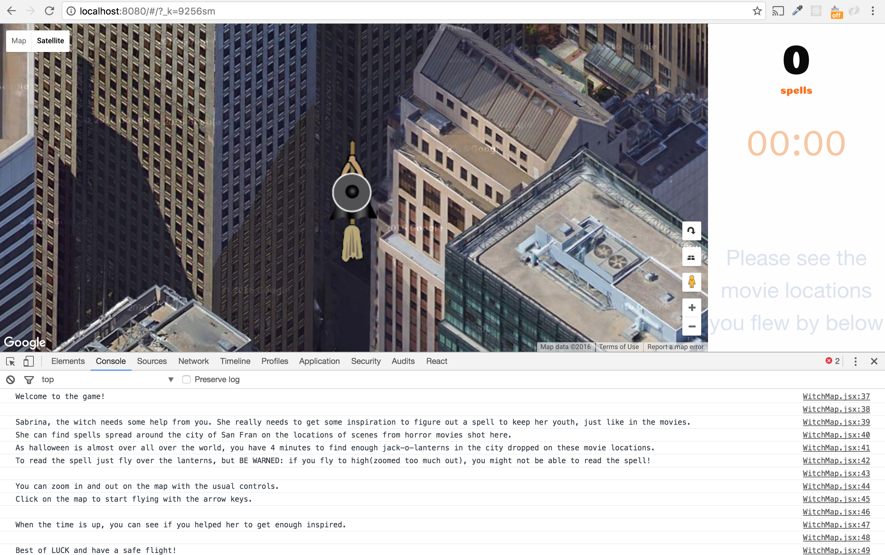
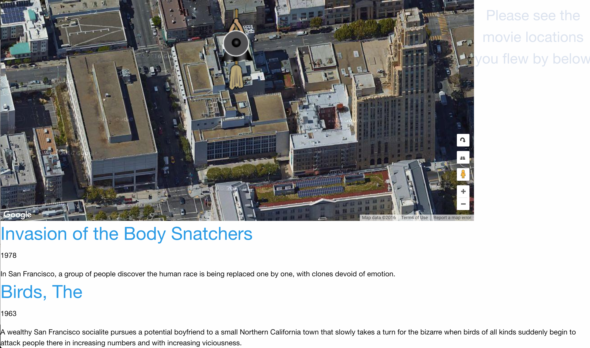

#San Francisco's Magic Locations

Get to know SF's breathtaking movie scene while playing a game!

##Instructions
_You can find these instructions in the console when you start the game._

Welcome to the game!

Sabrina, the witch needs some help from you. She really needs to get some inspiration to figure out a spell to keep her youth, just like in the movies.
She can find spells spread around the city of San Fran on the locations of scenes from horror movies shot here.
As halloween is almost over all over the world, you have 4 minutes to find enough jack-o-lanterns in the city dropped on these movie locations.
To read the spell just fly over the lanterns, but BE WARNED: if you fly to high(zoomed too much out), you might not be able to read the spell!

You can zoom in and out on the map with the usual controls.
Click on the map to start flying with the arrow keys.

When the time is up, you can see if you helped her to get enough inspired.

Best of LUCK and have a safe flight!

##Installation
_assuming Go and mysql is installed_

- create a mysql database called uber without password from the sql file in src/db.
- go get github.com/go-sql-driver/mysql
- go get github.com/gorilla/mux
- mkdir YOUR_GOPATH/src/github.com/timea/ and cd in here
- git clone https://github.com/timea/uberSF.git
- cd YOUR_GOPATH/src/github.com/timea/uberSF/src/uberSF (you need to be in the folder for go files)
- go install
- uberSF (assuming your bin is in your path. You need to run the binary from the folder you cd-ed in in step 6)
- open localhost:8080

##Screenshots
Start screen

Overview

Flyby

Below

##Video
[Gameplay](https://drive.google.com/file/d/0B1y7015oRTouMlJlZEZNZXo4OFk/view?usp=sharing)

#The Team and Big Thanks!

- UBER DK - you inspired the project
- [Roland Körmöczy](https://dk.linkedin.com/in/roland-kormoczy-17046112b) - idea of the game, support, debugging and massage
- [Johnny Fekete](https://es.linkedin.com/in/johnnyfekete) - JS help, keeping company and laugh
- [Szilvia Pálmai](https://dk.linkedin.com/in/szilvia-palmai-a9638050) - the artwork representing the witch
- @sallymroberts - database of the SceneFrancisco project (very well sanitized data from the starting point of the public data, even extended. Thanks! )
